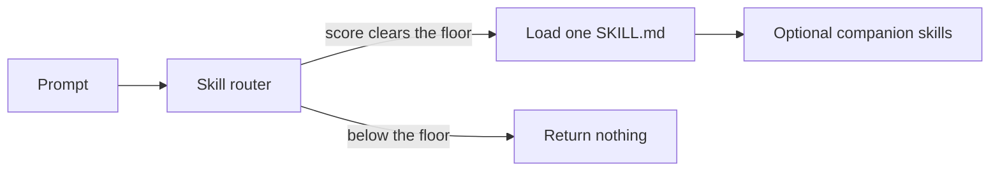
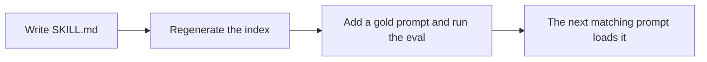

# Skill Router

Point a coding agent at **one** skill before it acts. The rest of the library stays on disk.

You keep skills as `SKILL.md` files. This repo ranks a prompt against their names and descriptions and returns the skill to load. If nothing is a confident match, it returns an empty list. Empty means: do not pretend a skill applied.

Works with any skill catalog. The sample skills in this repo are illustrations so you can run it immediately.

## How a prompt is routed



The ranker is a normal keyword match, weighted so a rare word counts more than a common one. The implementation is BM25, in `lib/score.mjs`. It does not read the skill body when it chooses. The body is loaded only after a skill wins, via `read_skill`.

## Requirements

- Node.js 18 or newer
- No `npm install` to run the router

## Try it

```bash
git clone https://github.com/lparuchuru-titan/skill-router.git
cd skill-router
node scripts/generate-index.mjs
```

Ask the server which skill owns a task:

```bash
printf '%s\n' \
  '{"jsonrpc":"2.0","id":1,"method":"initialize","params":{}}' \
  '{"jsonrpc":"2.0","id":2,"method":"tools/call","params":{"name":"find_skill","arguments":{"query":"write a jest unit test for the parser"}}}' \
  | node mcp/server.mjs
```

You want a hit on `write-unit-tests`. A prompt like "what is a good lasagna recipe" should come back as `[]`.

Check the whole gold set:

```bash
node eval/run-eval.mjs --gate 80
```

That exits non-zero if Recall@1 drops under 90% or if an out-of-scope prompt fires.

## Use it from an agent

The agent should do this on a task prompt:

1. Call `find_skill` with the user's words.
2. If the list is empty, answer directly. Do not invent a skill.
3. If there is a hit, call `read_skill` on that name and follow the file.
4. If `loadWith` names other skills, read those in the same turn. They ride along. They did not win the ranking.

### Claude Code

From the repo root, using your real checkout path:

```bash
claude mcp add skill-router --scope user \
  -e SKILL_ROUTER_ROOT="$PWD" \
  -- node "$PWD/mcp/server.mjs"
```

### Cursor, or any other MCP client

Put this in the client's MCP config. Replace the path.

```json
{
  "mcpServers": {
    "skill-router": {
      "command": "node",
      "args": ["/absolute/path/to/skill-router/mcp/server.mjs"],
      "env": {
        "SKILL_ROUTER_ROOT": "/absolute/path/to/skill-router"
      }
    }
  }
}
```

A copy of that block is in `mcp/example.mcp.json`.

### Tools

| Tool | When to call it | What you get back |
| --- | --- | --- |
| `find_skill` | First, with the user's task | Ranked skill, matched words, and companions. `[]` when the router abstains. |
| `read_skill` | After a hit | The full `SKILL.md` to follow. |
| `list_skills` | When you need the catalog | Name and one-line summary. Optional substring filter. |
| `search_topics` | The winning skill has a notes folder | Topic hits inside that skill. |
| `read_topic` | After `search_topics` | One note. |

`find_skill` arguments: `query` (required), `limit` (optional, default 5).

## Add a skill



1. Create `skills/<name>/SKILL.md`:

```markdown
---
name: review-a-migration
description: Review a database migration for locks, backfill, and rollback. Use when the user says migration, backfill, or schema change.
---

# Review a migration

1. Name the lock risk and the rollback.
2. Do not invent a migration tool that is not in the repo.
```

The description is the routing signal. Use the words a person would type. The body is the procedure, loaded only after this skill wins.

2. Optional: if another skill should load beside it, add a rule in `router/intents.json`. `also` is attached after a winner is chosen. It does not change who wins.

```json
{ "id": "review-migration", "skill": "review-a-migration", "also": ["write-unit-tests"], "why": "A migration review often needs a test." }
```

3. Add one line to `eval/prompts.jsonl` that must hit the new skill. Add an out-of-scope line too if the new words are broad (`"expected": []` means the router must abstain).

4. Rebuild and test:

```bash
node scripts/generate-index.mjs
node eval/run-eval.mjs --gate 80
```

If Recall@1 drops, or a negative prompt returns a skill, the new description is overlapping a neighbor. Fix the description before you add the next skill. You do not edit the ranker.

To point the router at a skills folder you already have:

```bash
node scripts/generate-index.mjs --skills-dir ~/.claude/skills --out-dir .
```

Then set `SKILL_ROUTER_SKILLS_DIR` to that same folder when you start the server. Retune `SKILL_ROUTER_FLOOR` with the eval. A floor that worked for seven sample skills will be wrong for a catalog of ninety.

## Optional: hint before the turn starts

`hooks/route-hint.mjs` prints one line when it is confident, and prints nothing otherwise. It will not block the session if the index is missing.

```bash
echo '{"prompt":"write a jest unit test for the parser"}' | node hooks/route-hint.mjs
node hooks/review-log.mjs
```

Wire it only if you want the nudge on every prompt. Calling `find_skill` from the agent is the default.

## Environment

| Variable | Purpose | Default |
| --- | --- | --- |
| `SKILL_ROUTER_ROOT` | Checkout that holds `router/` and `skills/` | Parent of `mcp/server.mjs` |
| `SKILL_ROUTER_SKILLS_DIR` | Skills live outside the checkout | `skills/` inside the root |
| `SKILL_ROUTER_FLOOR` | Abstain unless the top score clears this | `1.5` on the sample catalog |
| `SKILL_ROUTER_RARE_IDF` | Hook only: a matched word must be this distinctive | `1.2` |
| `SKILL_ROUTER_LOG` | Hook log path, or `off` | `hooks/route-hint.log.jsonl` |

## What is in the repo

```
skills/*/SKILL.md          procedures the agent loads after a hit
router/intents.json        companion map; it does not vote
router/skills-index.json   generated catalog
ROUTER.md                  generated table of the same catalog
mcp/server.mjs             stdio MCP server
eval/                      gold prompts and Recall@1 / MRR
hooks/route-hint.mjs       optional one-line hint
docs/                      the blog post
```

## Why the match stays on the name and the description

The numbers live in `eval/results.md`, written by `node eval/compare.mjs` from `eval/prompts.jsonl` (70 task prompts, 12 of them worded differently from the skill, plus 10 that must get no skill) and the 19 skills in this repo. Quote that file if it disagrees with this table. “BM25” in the table is the shipped matcher: rare words count more than common ones.

| Scorer | Recall@1 | Recall@3 | MRR | False fires |
| --- | --- | --- | --- | --- |
| Intent list (first matching phrase) | 78.6% (55/70) | 78.6% | 0.786 | 0/10 |
| Token overlap, no IDF | 82.9% (58/70) | 85.7% | 0.843 | 0/10 |
| BM25 on name, description, keywords | 82.9% (58/70) | 84.3% | 0.833 | 0/10 |
| BM25 plus the full skill body | 80.0% (56/70) | 84.3% | 0.817 | 3/10 |

Every direct prompt hits. Every paraphrase misses, because those prompts avoid the skill’s vocabulary. Adding the skill body lowers Recall@1 and starts answering prompts that should abstain. The server ships the frontmatter BM25 row. There is no embedding scorer in this repo.

## Blog post

`docs/Load-the-Right-Skill-First.docx` is the external write-up: why a skill library is not enough, a Salesforce skill slice, and how the router picks one skill.

## License

MIT. Copyright 2026 Lakshmikanth Paruchuru.
