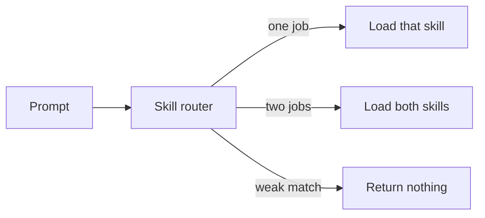
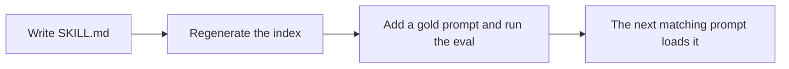

# Skill Router

Point a coding agent at the skills a prompt needs before it acts. One job loads one skill. Two jobs load both. The rest of the library stays on disk.

You keep skills as `SKILL.md` files. This repo compares a prompt with their names and descriptions and returns the skills to load. If nothing is a confident match, it returns an empty list. Empty means: do not pretend a skill applied.

Works with any skill catalog. The files in `skills/` are samples so you can run the router immediately. Point it at skills you wrote, or at `skills/` from [forcedotcom/sf-skills](https://github.com/forcedotcom/sf-skills). The samples are not the library. The router is.

## How a prompt is routed



The match is a normal keyword match, weighted so a rare word counts more than a common one. The code is in `lib/score.mjs`. It does not read the skill body when it chooses. A skill is included when the prompt uses that skill’s job phrase, such as “formula field” or “code coverage.” The body is loaded afterward, via `read_skill`, for every skill in the set.

## Requirements

- Node.js 18 or newer
- No `npm install` to run the router

## Try it

```bash
git clone https://github.com/lparuchuru-titan/skill-router.git
cd skill-router
node scripts/generate-index.mjs
```

Ask the server which skills a task needs:

```bash
printf '%s\n' \
  '{"jsonrpc":"2.0","id":1,"method":"initialize","params":{}}' \
  '{"jsonrpc":"2.0","id":2,"method":"tools/call","params":{"name":"find_skill","arguments":{"query":"write a jest unit test for the parser"}}}' \
  | node mcp/server.mjs
```

In the reply, look for `"skill": "write-unit-tests"`. A prompt like "what is a good lasagna recipe" should come back as `[]`.

A prompt with two jobs should name both skills. Try `Add a formula field for renewal date and grant field-level security on the sales permission set`. The list should include `platform-custom-field-generate` and `platform-permission-set-generate`.

Check the whole gold set:

```bash
node eval/run-eval.mjs --gate 80
```

That exits non-zero if the returned set stops matching the skills the prompt needs at least 80 percent of the time, or if an out-of-scope prompt fires.

## Use it from an agent

The agent should do this on a task prompt:

1. Call `find_skill` with the user's words.
2. If the list is empty, answer directly. Do not invent a skill.
3. Call `read_skill` on every name in the list, and follow each file. One prompt can need one skill or several. The list is the set to load, not a menu of alternatives.

### Claude Code

From the repo root, using your real checkout path:

```bash
claude mcp add skill-router --scope user \
  -e SKILL_ROUTER_ROOT="$PWD" \
  -- node "$PWD/mcp/server.mjs"
```

### Cursor, or any other MCP client

Put this in the client's MCP config. Replace the path.

```json
{
  "mcpServers": {
    "skill-router": {
      "command": "node",
      "args": ["/absolute/path/to/skill-router/mcp/server.mjs"],
      "env": {
        "SKILL_ROUTER_ROOT": "/absolute/path/to/skill-router"
      }
    }
  }
}
```

A copy of that block is in `mcp/example.mcp.json`.

### Tools

| Tool | When to call it | What you get back |
| --- | --- | --- |
| `find_skill` | First, with the user's task | The skills to load, as a list. One, or several. Read every name. `[]` when the router abstains. |
| `read_skill` | Once per returned skill | The full `SKILL.md` to follow. |
| `list_skills` | When you need the catalog | Name and one-line summary. Optional substring filter. |
| `search_topics` | A loaded skill has a notes folder | Topic hits inside that skill. |
| `read_topic` | After `search_topics` | One note. |

`find_skill` arguments: `query` (required), `limit` (optional, default 5).

## Add a skill



1. Create `skills/<name>/SKILL.md`:

```markdown
---
name: review-a-migration
description: Review a database migration for locks, backfill, and rollback.
keywords: database migration, schema change, backfill
---

# Review a migration

1. Name the lock risk and the rollback.
2. Do not invent a migration tool that is not in the repo.
```

The description is what the score reads. The `keywords` line holds the job phrases, separated by commas. A prompt that contains one of those phrases loads this skill. If the same prompt also contains another skill’s phrase, both load. Words in the description alone do not add a second skill. The body is the procedure, loaded only after this skill is chosen.

2. Add one line to `eval/prompts.jsonl` that must return the new skill. If a real prompt needs this skill and another, add a line whose `expected` array lists both. Add an out-of-scope line too if the new words are broad (`"expected": []` means the router must abstain).

3. Rebuild and test:

```bash
node scripts/generate-index.mjs
node eval/run-eval.mjs --gate 80
```

If the exact set drops under 80 percent, or a negative prompt returns a skill, the new description is overlapping a neighbor. Fix the description before you add the next skill. You do not edit the ranker.

To point the router at skills you already have, pass that folder. For the Salesforce skills library, clone it and pass its `skills` directory:

Run this from the skill-router folder. It clones the Salesforce library next to the router and rewrites the local index. The sample files in `skills/` stay where they are.

```bash
git clone https://github.com/forcedotcom/sf-skills.git
node scripts/generate-index.mjs --skills-dir sf-skills/skills --out-dir .
```

A folder of skills you wrote is the same command with your path. If the clone is somewhere else, pass that path instead of `sf-skills/skills`. Then set `SKILL_ROUTER_SKILLS_DIR` to that same folder when you start the server. Those files need a name and a description. Add a `keywords` line, comma-separated job phrases, on any skill a prompt should load beside another. Without that line, a prompt still loads the single best match. Retune `SKILL_ROUTER_FLOOR` with the eval. A floor that worked on this sample catalog will be wrong for a much larger one.

## Optional: hint before the turn starts

`hooks/route-hint.mjs` prints one line when it is confident, and prints nothing otherwise. It will not block the session if the index is missing.

```bash
echo '{"prompt":"write a jest unit test for the parser"}' | node hooks/route-hint.mjs
node hooks/review-log.mjs
```

Wire it only if you want the nudge on every prompt. Calling `find_skill` from the agent is the default.

## Environment

| Variable | Purpose | Default |
| --- | --- | --- |
| `SKILL_ROUTER_ROOT` | Checkout that holds `router/` and `skills/` | Parent of `mcp/server.mjs` |
| `SKILL_ROUTER_SKILLS_DIR` | Skills live outside the checkout | `skills/` inside the root |
| `SKILL_ROUTER_FLOOR` | Abstain unless the top score clears this | `1.5` on the sample catalog |
| `SKILL_ROUTER_RARE_IDF` | Hook only: a matched word must be this distinctive | `1.2` |
| `SKILL_ROUTER_LOG` | Hook log path, or `off` | `hooks/route-hint.log.jsonl` |

## What is in the repo

```
skills/*/SKILL.md          procedures the agent loads after a hit
router/intents.json        phrase list used only by the eval comparison
router/skills-index.json   generated catalog
ROUTER.md                  generated table of the same catalog
mcp/server.mjs             stdio MCP server
eval/                      gold prompts; a prompt may expect one skill or several
hooks/route-hint.mjs       optional one-line hint
docs/                      the blog post
```

## Why the match stays on the name and the description

The numbers live in `eval/results.md`, written by `node eval/compare.mjs` from `eval/prompts.jsonl` (75 task prompts, 5 of them asking for two skills, 12 worded differently from the skill, plus 10 that must get no skill) and the sample skills in this repo. The count is the size of that sample, not a limit on your catalog. Quote that file if it disagrees with this table. “Only the skills asked for” means the skills returned are the skills the prompt needs, with none missing and no extras. The shipped row is the one that reads the name and the one-line description. Rare words count more than common ones. The code is in `lib/score.mjs`.

| How we picked | Right skill first | Only the skills asked for | Unrelated prompts answered |
| --- | --- | --- | --- |
| Phrase list. First match wins. | 80% (60/75) | 73.3% (55/75) | 0/10 |
| Count the words in common. | 84% (63/75) | 9.3% (7/75) | 0/10 |
| Name and one-line description. This is what ships. | 84% (63/75) | 84% (63/75) | 0/10 |
| Name, description, and the whole skill file. | 84% (63/75) | 84% (63/75) | 3/10 |

Every prompt that uses the skill’s own words hits, including all 5 prompts that ask for two skills. Of the 12 prompts worded differently, 4 return nothing and 8 return a different skill. They avoid the skill’s vocabulary. Counting shared words puts the right skill first just as often here, and then returns neighboring skills the prompt did not ask for. Searching the whole skill file starts answering prompts that should get nothing. There is no embedding scorer in this repo.

## Blog post

`docs/Load-the-Right-Skill-First.docx` is the external write-up. The skills in the repo are samples. The post is about how a prompt loads one skill or several, including from skills you wrote or from forcedotcom/sf-skills.

## License

MIT. Copyright 2026 Lakshmikanth Paruchuru.
